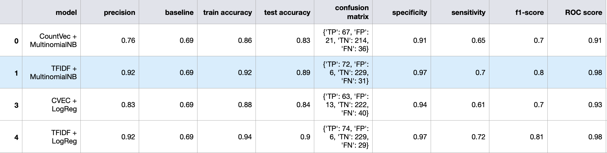
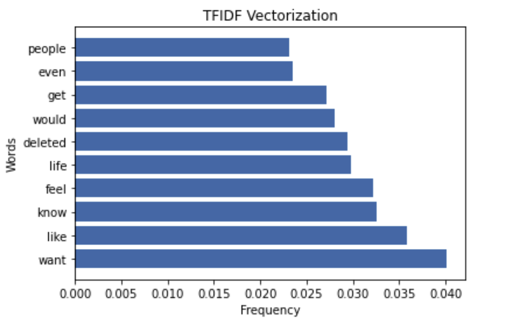
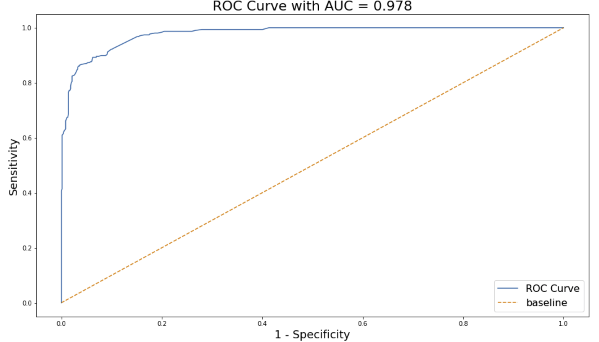

## Project 3: Web APIs & Classification - Using Natural Language Processing to Identify Suicidal Post and Domestic Violence Post

### Problem Statement

“As COVID-19 deaths rise, domestic violence murder-suicides are rising as well. In just the last week, domestic violence murder-suicides have increased 100%.”

Alarmingly in Singapore, according to a Straits Times article, there were 476 police reports filed for offences commonly associated with family violence from April 7 to May 6. This was a 22 per cent increase compared with the monthly average of 389 for such cases before the circuit breaker period.

To make matters worst, even before the circuit breaker, there was already 3 in 10 Singaporean were affected by domestic violence.

And the worrying thing is that survivors of intimate partner violence are twice as likely to attempt suicide multiple times and cases of murder-suicide are most likely to occur in the context of abuse.

The goal of this project is to use Natural Language Processing tools such as Naive Bayes Model and Logistic Regression. These models will be used to analyse text/datas from the two subreddits communities and machine-learn words from it which identify  potentially suicide note or someone pleading for help from domestic violence victims.

The Machine Learning Classifiers model that we have created aims to identify domestic violence victims easily and reduce suicidal rates for our human population in the online community, for a good cause.

Our classification model is measured to be successful if its accuracy is higher than the baseline, and AUC ROC score is more than 50%. The unseen data that will be input into our model should skew to one particular reddit which is either r/SuicideWatch or r/domesticviolence.

###  Data Collection

To start off with my project, I have chosen 2 subreddit which are r/domesticviolence and r/SuicideWatch, which will give us some datas relevant to identifying such individuals. These are 2 useful subreddits which provides online support to victims and the communities seems genuinely in helping and consoling people who are in need of help or to even provide a "virtual" listening ear for both communities.

Data collection via Reddit's API to collect approximately 1300 - 1800 post on each sub-reddit. Data cleaning was done by just extracting the "essence" which is the "selftext" in the data and time.sleep(1) was set to request data from the server.

### Data Cleaning & EDA

For each subreddit, we have merged selftext and subreddit columns into one dataset. These datas will be optimised and used in our NLP.

For each target feature, we have used one hot encoding for the following subreddit: 
- 0 for domestic violence
- 1 for suicide watch

Count Vectorizer was used and identified the most-used words from each subreddit which helps us to understand our data.

### Preprocessing & Modeling  

Preprocessing has been performed with the following steps for better modelling:
- Remove punctuations
- Lemmatize words
- Remove stop words, including words commonly associated from both subreddits
- Train test split method was used for training and validation purpose
- Pipeline with the 2 vectorizers: CountVectorizer & TfidfVectorizer
- Classifier models such as Logistic Regression and Multinomial Naive Bayes used for NLP
- GridsearchCV for tuning the hyperparameters of all models

### Evaluation Our Best Model

Final production model: (TF-IDF Vectorizer + Multinomial Naive Bayes).

It generalise best with only **0.03** variation from its Training to Test set scores.
TF-IDF Vectorizer scored better in terms the sensitivity which predict and identify domestic violence or potential suicide cases(True Positives) more accurately. 

TFIDF Vectorizer weighted "want" higher than "like" compared to Count Vectorizer, when "like" appeared more times than "want" in suicide posts. Because TF-IDF "penalises" words that appearing too often. These words might be a good indicator to build models that might be able to predict and identify domestic violence victim, which will likely to be able to answer our problem statement.

With the **Sensitivity of 0.7 and AUC score 0.978** - For further improvement to our model, it will be good that we gather more data to build on model and so as to perform a more robust textual analysis. The true-positive rate is known as sensitivity, recall or probability of detection in machine learning, in this case, detecting more possible depression case in our domestic violent post online.

### Conclusion & Recommendation

As most suicide case is preventable and more often than not, individuals don’t want to end their lives – they just want to get out of the overwhelming or painful situation they are in but they can’t do it alone.

Through this model, we are able to detect to potential suicide post and from domestic violence post on reddit, with accuracy score of 0.92. Given the high performance of the model, it is clear that we achieved the objective of our project successfully.

The findings of this research will be useful for researchers, psychologist who likes to understand more on how a person who is facing domestic violence and having suicidal thoughts, behaves and present their thoughts and feelings in the online communities.

Our model can be fully utilised if we were to encourage forum/online communities owner to include our NLP machine fo a good cause. Further enhancement can be made by including more reddits to identify more depressive key words since theres so many sub categories of depression and include different social media platform such as twitter & facebook to include into our model for further enhancement.

### References

https://www.allianceforhope.com/the-pandemic-within-the-pandemic-we-need-to-offer-hope/

https://www.tnp.sg/news/singapore/3-10-here-affected-domestic-abuse-study

https://www.straitstimes.com/singapore/courts-crime/coronavirus-more-cases-of-family-violence-during-circuit-breaker-police-to

https://www.apa.org/monitor/2014/11/suicide-violence
